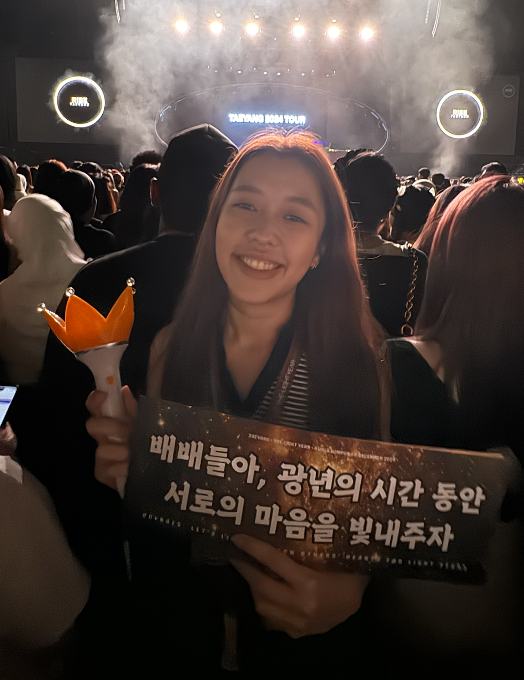
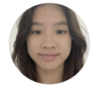

# About Us

We are a team based in the [School of Computing, National University of Singapore](http://www.comp.nus.edu.sg).

You can reach us at the email `seer[at]comp.nus.edu.sg`

## Project team

### Roger Lim Bo Zu

[[github](http://github.com/meowzz28)]
[[portfolio](team/johndoe.md)]

* Role: Team Lead
* Responsibilities: Integration

### Chong Yi Jie

[[github](http://github.com/yijiechong13)]
[[portfolio](team/johndoe.md)]

* Role: Developer
* Responsibilities: Documentation, deliverables and deadlines

### Ee Syuen

[[github](http://github.com/eesyuen09)] 
[[portfolio](team/johndoe.md)]

* Role: Developer
* Responsibilities: Documentation and code quality

### Tey Yee Siang

[[github](http://github.com/ystey0808)]
[[portfolio](team/johndoe.md)]

* Role: Developer
* Responsibilities: Testing, scheduling and tracking

### Denise Goh

[[github](https://github.com/deniseegohh)]
[[portfolio](team/denisegoh.md)]

* Role: Developer
* Responsibilities: Code Quality
