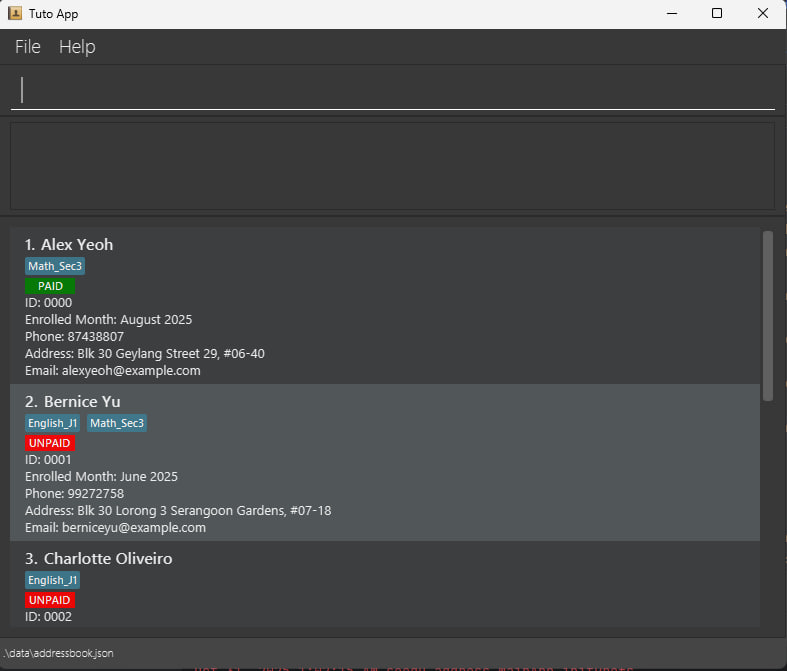
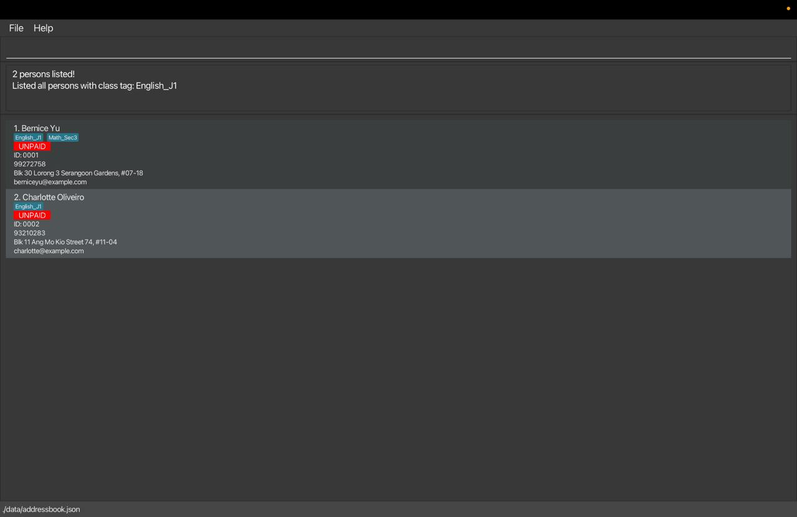

# Tuto User Guide

Welcome to Tuto—your all-in-one solution designed to help freelance tutors focus on what truly matters: **teaching**.

<!-- * Table of Contents -->
<page-nav-print />

--------------------------------------------------------------------------------------------------------------------

## 1. Introduction

### 1.1 What is Tuto?

Tuto is a **desktop application specifically designed for freelance tutors** who need an efficient way to manage their students, track attendance and performance, and handle tuition fee payments—all in one centralized platform.

As a freelance tutor, you juggle multiple students across different classes, track various schedules, and manage administrative tasks that take time away from teaching. Tuto simplifies these challenges by providing a powerful Command Line Interface (CLI) that allows you to quickly execute commands while enjoying the benefits of a clean Graphical User Interface (GUI) for visualizing your student data.

Whether you're teaching one-on-one or managing multiple group classes, Tuto is built to reduce your administrative workload so you can dedicate more time and energy to your students' success.

### 1.2 Main Features

Tuto offers comprehensive features tailored to the needs of freelance tutors:

**Student Management**
- Add, edit, find, and delete student records with ease
- Each student is automatically assigned a unique **4-digit Student ID** (e.g., `0234`, `5832`) upon creation
- Store essential contact information including name, phone numbers, emails, and addresses
- Optionally set an enrollment month to prevent recording attendance, performance, or fees before the student joined

**Class Management**

**Attendance Management**
- Mark students as present or absent for each date and class
- View complete attendance history for any student

**Performance Management**
- Record performance notes for each student based on class and date
- Document achievements, areas for improvement, and progress over time
- View comprehensive performance history to track student development

**Fee Management**
- Mark monthly tuition payments as paid or unpaid
- Track payment history from enrollment month to current month
- Filter students by payment status for a specific month to easily view who has paid or not paid

--------------------------------------------------------------------------------------------------------------------

## 2. Getting Started

### 2.1 Installation

1. Ensure you have Java `17` or above installed in your Computer. 
   **Mac users:** Ensure you have the precise JDK version prescribed [here](https://se-education.org/guides/tutorials/javaInstallationMac.html).

2. Download the latest `.jar` file from [here](https://github.com/se-edu/addressbook-level3/releases).

3. Copy the file to the folder you want to use as the _home folder_ for your AddressBook.

4. Open a command terminal, `cd` into the folder you put the jar file in, and use the `java -jar tuto.jar` command to run the application. 
   A GUI similar to the below should appear in a few seconds. Note how the app contains some sample data. 
   

5. Type the command in the command box and press Enter to execute it. e.g. typing **`help`** and pressing Enter will open the help window. 
   Some example commands you can try:

   * `list` : Lists all students.

   * `add n/John Doe p/98765432 e/johnd@example.com a/John street, block 123, #01-01` : Adds a student named `John Doe` to Tuto.

   * `clear` : Deletes all contacts.

   * `exit` : Exits the app.

6. Refer to the [Command section](#3-commands) below for details of all commands supported by Tuto.

### 2.2 How to Use Tuto Commands

Tuto operates primarily through text-based commands. Before we explore the specific commands in detail in the Commands section, let's familiarize ourselves with the basic components and format of a command.

<box type="tip" seamless>

**Important:** All command words are case-sensitive!
`add` is different from `ADD` or `Add`

</box>

#### 2.2.1 Parameter Prefixes

In Tuto, a parameter prefix acts as a delimiter for specifying different types of parameters in commands. Here's a reference table for common parameter prefixes and their corresponding parameters:

| Parameter Prefix | Corresponding Parameter             |
|------------------|-------------------------------------|
| `n/`             | NAME                                |
| `s/`             | STUDENT_ID                          |
| `p/`             | PHONE                               |
| `e/`             | EMAIL                               |
| `a/`             | ADDRESS                             |
| `m/`             | ENROLLED_MONTH or MMYY (month/year) |
| `t/`             | TAG_NAME                            |
| `d/`             | DATE (DDMMYYYY format)              |
| `pn/`            | PERFORMANCE_NOTE                    |

#### 2.2.2 Parameters

In Tuto, a parameter represents a placeholder where users input data. Parameters typically follow immediately after their corresponding Parameter Prefixes. Essentially, they are to be supplied the user.

<box type="info" seamless>

**Note:** All user inputs including parameters will be trimmed (all leading and trailing whitespaces will be ignored).

</box>

**Parameter Details:**

| Parameter          | Prefix | Description                                                                                                                                                                                                                                |
|--------------------|--------|--------------------------------------------------------------------------------------------------------------------------------------------------------------------------------------------------------------------------------------------|
| `NAME`             | `n/`   | Specifies the name of a student.  **Requirements:** • Names must contain only alphabetic characters and whitespace. • Names with only whitespace are not allowed.                                                              |
| `STUDENT_ID`       | `s/`   | Specifies the Student ID of a student.  **Requirements:** • IDs are automatically assigned in 4-digit format (e.g., `0234`, `5832`).                                                              |
| `PHONE`            | `p/`   | Specifies the phone number of a student.  **Requirements:** • Phone numbers must contain only numeric digits. • Must be at least 3 digits long.                                                                                |
| `EMAIL`            | `e/`   | Specifies the email address of a student.  **Requirements:** • Format: `local-part@domain`. • Local part can contain alphanumeric characters and special characters `+`, `_`, `.`, `-`. • Local part cannot start or end with special characters. • Domain must end with a label at least 2 characters long. • Each domain label must start and end with alphanumeric characters. |
| `ADDRESS`          | `a/`   | Specifies the residential address of a student.  **Requirements:** • Can contain letters, digits, spaces, and the symbols `#`, `,`, `-`, `'`. • Cannot be blank. • First character cannot be a whitespace.                  |
| `MMYY`             | `m/`   | Specifies a month and year for enrollment or payment tracking.  **Requirements:** • Format: `MMYY` (e.g., `0825` for August 2025). • MM must be 01-12, YY is the last two digits of the year.                                  |
| `TAG_NAME`         | `t/`   | Specifies a class tag to categorize students.  **Requirements:** • Must be 1-30 characters long. • Can only contain alphanumeric characters and underscores (`_`). • Tag must exist in the system before assignment to students. | |
| `DATE`             | `d/`   | Specifies a date for attendance or performance tracking.  **Requirements:** • Format: `DDMMYYYY` (e.g., `15092025` for 15 September 2025).           |
| `PERFORMANCE_NOTE` | `pn/`  | Specifies a performance note for a student.  **Requirements:** • Can be any text under 200 characters.                                                                |

#### 2.2.3 Command Format

To understand how a full command is interpreted, let's examine the following example.

**Example:** `add n/NAME p/PHONE e/EMAIL a/ADDRESS [m/ENROLLED_MONTH] [t/TAG_NAME]...`

<box type="tip" seamless>

**Tip:**
Adding class tags before enrolling students makes the process more efficient! Create your class tags first using `tag -a t/TAG_NAME`, then you can assign them to students when adding them.

</box>

<box type="info" seamless>

**Key Points:** 

* Words in `UPPER_CASE` are the parameters to be supplied by the user. 
  e.g. in `add n/NAME`, `NAME` is a parameter which can be used as `add n/John Doe`.

* Items in square brackets are optional. 
  e.g `n/NAME [t/TAG_NAME]` can be used as `n/John Doe t/Math` or as `n/John Doe`.

* Items with `…`​ after them can be used multiple times including zero times. 
  e.g. `[t/TAG_NAME]…​` can be used as ` ` (i.e. 0 times), `t/Math`, `t/Math t/Science` etc.

* Parameters can be in any order. 
  e.g. if the command specifies `n/NAME p/PHONE_NUMBER`, `p/PHONE_NUMBER n/NAME` is also acceptable.

* Extraneous parameters for commands that do not take in parameters and flags (such as `help`, `list`, `exit` and `clear`) will be ignored. 
  e.g. if the command specifies `help 123`, it will be interpreted as `help`.

* If you are using a PDF version of this document, be careful when copying and pasting commands that span multiple lines as space characters surrounding line-breaks may be omitted when copied over to the application.
  </box>

**General Notes about Tuto Commands:**

A command can be categorized into four formats:

1. **COMMAND + FLAG + PARAMETER_PREFIX + PARAMETER**
   - Example: `tag -a t/Math_Sec3`, `fee -p s/0001 m/0925`, `att -m s/0001 d/15092025 t/Math_Sec3`
   - Common flags include:
     - `-a` (add), `-d` (delete), `-l` (list), `-e` (edit), `-v` (view)
     - `-p` (paid), `-up` (unpaid)
     - `-m` (mark), `-u` (unmark/absent)
     - `-t` (tag filter) 
        
2. **COMMAND + PARAMETER_PREFIX + PARAMETER**
   - Example: `add n/John Doe p/98765432 e/johnd@example.com a/John street, block 123, #01-01` 
      

3. **COMMAND + PARAMETER**
   - Example: `find John David` 
      

4. **COMMAND**
   - Example: `list`, `help`, `exit`, `clear` 
      

--------------------------------------------------------------------------------------------------------------------

## 3. Commands

### 3.1 Student Management

The Student Management commands allow you to **add, edit, find, delete, and list students** in the address book.  
Each student added is automatically assigned a unique **Student ID** (in 4-digit format, e.g. 0234, 5832),  
which is used in other commands such as fees, attendance, and performance tracking.

<box type="info" seamless>

**Overview of Student Management Commands**

| Command                                                                      | Description                             |
|------------------------------------------------------------------------------|-----------------------------------------|
| `add n/NAME p/PHONE e/EMAIL a/ADDRESS [m/ENROLLED_MONTH] [t/TAG_NAME]...`    | Add a new student to the address book   |
| `edit s/STUDENT_ID [n/NAME] [p/PHONE] [e/EMAIL] [a/ADDRESS] [t/TAG_NAME]...` | Edit details of an existing student     |
| `find KEYWORD [MORE_KEYWORDS]`                                               | Find students by name                   |
| `delete s/STUDENT_ID`                                                        | Delete a student using their Student ID |
| `list`                                                                       | List all students                       |
| `clear`                                                                      | Clear all student entries               |

</box>

#### 3.1.1 Adding a student : `add`

Adds a new student to the address book.

**Format:** `add n/NAME p/PHONE e/EMAIL a/ADDRESS [m/ENROLLED_MONTH] [t/TAG_NAME]...`

**Command Details and Constraints:**
* Creates a new student record with the specified name, phone number, email, and address.
* The `ENROLLED_MONTH` and `TAG_NAME` fields are optional.
* A student can have multiple class tags or none at all.
* Tags must exist in the system. If a specified tag does not exist, the command will be rejected.

<box type="tip" seamless>
You can add multiple tags by specifying `t/TAG_NAME1 t/TAG_NAME2 ...`.  
A student can also be added without any tags.
</box>

**Examples:**
- `add n/John Doe p/98765432 m/0825 e/johnd@example.com a/John street, block 123, #01-01` — adds a student with no tags.
  >**Expected output:**  
  `New student added: John Doe; Phone: 98765432; Email: johnd@example.com; Address: John street, block 123, #01-01; Tags: -`
- `add n/Betsy Crowe t/Math_Sec3 e/betsycrowe@example.com a/Clementi p/12345678 t/English_J1` — adds a student with two tags: `Math_Sec3` and `English_J1`.
  >**Expected output:**  
  `New student added: Betsy Crowe; Phone: 12345678; Email: betsycrowe@example.com; Address: Clementi; Tags: [Math_Sec3][English_J1]`
  

#### 3.1.2 Editing a student : `edit`

Edits the details of an existing student in the address book using their Student ID.

**Format:** `edit s/STUDENT_ID [n/NAME] [p/PHONE] [e/EMAIL] [a/ADDRESS] [t/TAG_NAME]...`

**Command Details and Constraints:**
* Updates the student identified by the given `STUDENT_ID`.
* At least one optional field must be provided.
* Existing details will be replaced by the new input values.
* When editing class tags:
    * To add tags: specify `t/TAG1 t/TAG2 ...` (existing tags remain, new ones are added).
    * To clear all tags: use `t/` with no tags provided.

<box type="tip" seamless>
You can update multiple fields in a single command.
</box>

**Examples:**
- `edit s/0006 p/91234567 e/johndoe@example.com` — edits the phone number and email of the student with ID `2042`.
  >**Expected output:**  
  `Edited student: John Doe; Phone: 91234567; Email: johndoe@example.com; Address: John street, block 123, #01-01; Tags: -`
- `edit s/0006 n/Betsy Crower t/Math_Sec3 t/English_J1` — changes the name of student `2042` and updates the student’s tags to `Math_Sec3` and `English_J1`.
  >**Expected output:**  
  `Edited student: Betsy Crower; Phone: 91234567; Email: johndoe@example.com; Address: John street, block 123, #01-01; Tags: [Math_Sec3][English_J1]`
- `edit s/0006 t/` — clears all tags.
  >**Expected output:**  
  `Edited student: Betsy Crower; Phone: 91234567; Email: johndoe@example.com; Address: John street, block 123, #01-01; Tags: -`
  

#### 3.1.3 Finding students : `find`

Finds students whose names contain any of the given keywords.

**Format:** `find KEYWORD [MORE_KEYWORDS]`

**Command Details and Constraints:**
* The search is **case-insensitive** (e.g. `hans` matches `Hans`).
* The order of keywords does not matter (e.g. `Hans Bo` matches `Bo Hans`).
* Only full words are matched (e.g. `Han` will not match `Hans`).
* Students matching at least one keyword will be displayed in the GUI.

<box type="tip" seamless>
Use multiple keywords to perform an OR search.
</box>

**Examples:**
- `find alex david` — displays all students with names containing “Alex” or “David”.
  >**Expected output:**  
  `2 persons listed!`
  

#### 3.1.4 Deleting a student : `delete`

Deletes a specified student from the address book using their Student ID.

**Format:** `delete s/STUDENT_ID`

**Command Details and Constraints:**
* Removes the student with the matching Student ID from the address book.
* The Student ID must correspond to an existing student.

**Examples:**
- `delete s/0007` — deletes the student with ID `0007`.
  >**Expected output:**  
  `Deleted student: Betsy Crowe; Phone: 1234567; Email: betsycrowe@example.com; Address: Newgate Prison; Tags: [Math_Sec3][English_J1]`

#### 3.1.5 Listing all students : `list`

Displays all students currently stored in the address book.

**Format:** `list`

**Command Details and Constraints:**
* Shows a list of all students in the GUI panel.
* Each student entry displays their name, Student ID, enrolled month, phone number, email address, address, tags, and current month payment status.
* The list updates automatically whenever students are added, edited, or deleted.

>**Expected output:**  
`Listed all persons`

#### 3.1.6 Clearing all entries : `clear`

Clears all student records from the address book.

**Format:** `clear`

**Command Details and Constraints:**
* Removes all student entries permanently from the address book.
* This action cannot be undone.

>**Expected output:**  
`All students have been cleared.`

---
### 3.2 Class Tag Management

The Class Tag commands allow you to **create, delete, and list class tags** in the system.  
Class tags are useful for organizing students by the classes they attend (e.g. `Sec3_Maths`, `JC1_Physics`).

<box type="info" seamless>

**Overview of Class Tag Management Commands**

| Command             | Description                  |
|---------------------|------------------------------|
| `tag -a t/TAG_NAME` | Add a new class tag          |
| `tag -d t/TAG_NAME` | Delete an existing class tag |
| `tag -l`            | List all existing class tags |

</box>

#### 3.2.1 Adding a class tag : `tag -a`

Adds a new class tag to the system. This allows you to categorize students by the classes they attend.

**Format:** `tag -a t/TAG_NAME`

**Command Details and Constraints:**
* This command creates a new class tag with the specified `TAG_NAME`.
* If a tag with the same name (case-insensitive) already exists, the command will not create a duplicate and will inform the user.
* Tag names must be 1\-30 characters long and can only contain alphanumeric characters and underscores (`_`). Spaces or other special characters are not allowed.
* Tag names are case\-insensitive when checking for duplicates, but the original casing is preserved when added.

**Examples:**
- `tag -a t/Sec3_Maths` — Adds a class tag named `Sec3_Maths`.
  >**Expected output:** `New class tag added: Sec3_Maths`
- `tag -a t/JC1_Physics` — Adds a class tag named `JC1_Physics`.
  >**Expected output:** `New class tag added: JC1_Physics`
  

#### 3.2.2 Deleting a class tag : `tag -d`

Deletes an existing class tag from the system.

**Format:** `tag -d t/TAG_NAME`

<box type="warning" seamless>
<b>Warning:</b>
You can only delete a class tag if it is not currently assigned to any student in the address book. Remove the tag from all students first before deleting.
</box>

**Command Details and Constraints:**
* This command removes the class tag with the specified `TAG_NAME` from the system.
* If the specified tag does not exist, the command will inform the user.
* If the tag is currently assigned to one or more students, the command will not delete the tag and will inform the user to first remove the tag from all students.
* Tag name matching is case\-insensitive.

**Examples:**
- `tag -d t/Sec3_Maths` — Deletes the class tag named `Sec3_Maths`.
>**Expected output:** `Tag deleted: Sec3_Maths`
- `tag -d t/jc1_physics` — Deletes the class tag named `JC1_Physics`, regardless of case (if JC1_Physics exists in this casing).
>**Expected output:** `Tag deleted: JC1_Physics`

#### 3.2.3 Listing all class tags : `tag -l`

Shows a list of all class tags currently created in the address book.

**Format:** `tag -l`

**Examples:**
- `tag -l`: If class tags `JC1_Physics` and `Sec3_Maths` exist in the system.
>**Expected output:**
  `Listed all class tags:`
  `1. JC1_Physics`
  `2. Sec3_Maths`
- `tag -l`: If no class tags exist in the system.
>**Expected output:**
  `No class tags found. You can add one using the 'tag -a' command.`

---

### 3.3 Fee Management
The Fee Management Commands allows you to **record, update, and view student payment statuses**.  
This helps tutors and administrators track monthly tuition fee payments efficiently and keep student records up to date.
<box type="info" seamless>

**Overview of fee commands**

| Command                        | Description                                         |
|--------------------------------|-----------------------------------------------------|
| `fee -p s/STUDENT_ID m/MMYY`   | Marks a student as **PAID** for a specified month   |
| `fee -up s/STUDENT_ID m/MMYY`  | Marks a student as **UNPAID** for a specified month |
| `fee -v s/STUDENT_ID [m/MMYY]` | Views a student’s **payment history**               |
</box>

#### 3.3.1 Marking a student as paid: `fee -p`

Marks a student’s payment status as **PAID** for a specific month.

**Format:** `fee -p s/STUDENT_ID m/MMYY`

**Command Details and Constraints:**
* Tutors can only mark payments for months **between the student’s enrollment month and the current month (inclusive)**.
* Payments must follow **chronological order** — earlier months must be settled before marking later ones.
* Payments **before enrollment** or **in future months** are not allowed.
* If a month is already marked as **PAID**, duplicate payment attempts will be rejected.

**Examples:**
- `fee -p s/0001 m/0925` — marks student `0001` (Bernice Yu) as **PAID** for **September 2025**.
  > **Expected output:** `Bernice Yu has been successfully marked as Paid for September 2025.`

#### 3.3.2 Marking a student as unpaid: `fee -up`

Marks a student’s payment status as **UNPAID** for a specific month.  
Use this command for corrections or when a payment was mistakenly marked as PAID.

**Format:**  
`fee -up s/STUDENT_ID m/MMYY`

**Command Details and Constraints:**
* Tutors can only mark payments for months **between the student’s enrollment month and the current month (inclusive)**.
* Tutors may mark a previous month as **UNPAID**, even if later months are already paid — this allows for **real-world correction** of payment records.
* You cannot mark future months as UNPAID.
* If the month is already marked as UNPAID, the command will be rejected.
* Once corrected, the tutor must re-mark earlier unpaid months before recording new payments for later months.

**Examples:**
- `fee -up s/0001 m/0925` — marks student `0001` (Bernice Yu) as **UNPAID** for **September 2025**.
  > **Expected output:** `Bernice Yu has been successfully marked as Unpaid for September 2025.`
  

#### 3.3.4 Viewing a student’s payment history: `fee -v`

Displays a student’s **payment history** from a specified starting month up to the **current month**.

**Format:**  
`fee -v s/STUDENT_ID [m/MMYY]`

**Command Details and Constraints:**
* Tutors can view payment history **starting from any valid month** between the student’s enrollment month and the current month (inclusive).
* If the starting month is not provided, or it precedes the student’s enrollment month, the history will automatically start from the **enrollment month**.
* If the starting month is **after the current month**, the command will return an error message.
* The displayed history includes both **explicitly marked** months (via `fee -p` or `fee -up`) and **default UNPAID** months that were not manually recorded.

**Examples:**
- `fee -v s/0001` — shows payment history for student `0001` from their enrollment month to the current month.
  > **Expected Output:**  
  `Payment history for Alex Yeoh from August 2025 to October 2025 (3 months)`  
  `Enrolled Month: August 2025`  
  `August 2025 : PAID (marked)`  
  `September 2025 : PAID (marked)`  
  `October 2025 : UNPAID (default)`
- `fee -v s/0001 m/0525` — shows payment history starting **May 2025** to the current month.
    > **Expected Output:**  
  `Payment history for Alex Yeoh from August 2025 to October 2025 (3 months)`  
  `Enrolled Month: August 2025`  
  `August 2025 : PAID (marked)`  
  `September 2025 : PAID (marked)`  
  `October 2025 : UNPAID (default)`

<box type="info" seamless>

**Interpreting the results:**
- `marked` — the payment was explicitly set via `fee -p` or `fee -up`.
- `default` — the month had no explicit record and is assumed **UNPAID**.

</box>

---

### 3.4 Attendance management
The `att` command family allows you to **record, update, and view student attendance**.
Each attendance record is tied to both a date and a class tag, allowing tutors to manage students who attend multiple classes efficiently.

<box type="info" seamless>

**Overview of Attendance Management Commands**

| Command                                 | Description                                                                           |
|-----------------------------------------|---------------------------------------------------------------------------------------|
| `att -m s/STUDENT_ID d/DATE t/TAG_NAME` | Mark a student as present for a given date and class tag                              |
| `att -u s/STUDENT_ID d/DATE t/TAG_NAME` | Mark a student as absent for a given date and class tag or undoes a marked attendance |
| `att -d s/STUDENT_ID d/DATE t/TAG_NAME` | Delete an attendance record for a student on a specific date and class                |
| `att -v s/STUDENT_ID`                   | View a student's attendance records                                                   |

</box>

#### 3.4.1 Marking a student as present : `att -m`

Marks a student's attendance as **PRESENT** for a specific date and class.

**Format:** `att -m s/STUDENT_ID d/DATE t/TAG_NAME`

**Command Details and Constraints:**
* This command records that a student attended a specific class on a specific date.
* The student must have the specified class tag assigned to them.
* If the student doesn't have the tag, the command will be rejected with an error message.
* The date must be in `DDMMYYYY` format (e.g., `15092025` for 15 September 2025).

**Examples:**
- `att -m s/0001 d/15092025 t/Math` — Marks student `0001` (Bernice Yu) as present for 15 September 2025 in Math class.
  >**Expected output:** `Marked attendance for: Bernice Yu on 15-09-2025 for class Math`

#### 3.4.2  Marking a student as absent : `att -u`

Marks a student's attendance as **ABSENT** for a specific date and class.
Use this to record absences or to undo a previously marked **PRESENT** attendance by changing it to **ABSENT**.

**Format:** `att -u s/STUDENT_ID d/DATE t/TAG_NAME`

**Command Details and Constraints:**
* This command records that a student was absent from a specific class on a specific date.
* This command can also be used to undo a **PRESENT** attendance by changing it to **ABSENT**.
* The student must have the specified class tag assigned to them.
* If the student doesn't have the tag, the command will be rejected with an error message.
* The date must be in `DDMMYYYY` format (e.g., `15092025` for 15 September 2025).

**Examples:**
- `att -u s/0001 d/15092025 t/Math` — Marks student `0001` (Bernice Yu) as absent for 15 September 2025 in Math class.
  >**Expected output:** `Unmarked attendance for: Bernice Yu on 15-09-2025 for class Math`
  

#### 3.4.3 Deleting an attendance record : `att -d`

Deletes an attendance record for a student on a specific date and class.
Use this to remove attendance records that were marked by mistake or are no longer needed.

**Format:** `att -d s/STUDENT_ID d/DATE t/TAG_NAME`

**Command Details and Constraints:**
* This command removes an existing attendance record for a student.
* An attendance record must exist for the given date and class for the deletion to succeed.
* The student does **not** need to currently have the specified class tag assigned. This allows you to delete historical attendance records even after a student has left a class and the tag has been removed.
* The date must be in `DDMMYYYY` format (e.g., `15092025` for 15 September 2025).

**Examples:**
- `att -d s/0001 d/15092025 t/Math` — Deletes the attendance record for student `0001` (Bernice Yu) on 15 September 2025 in Math class.
  >**Expected output:** `Deleted attendance for: Bernice Yu on 15-09-2025 for class Math`
- `att -d s/0003 d/25082025 t/Science` — Attempts to delete an attendance record that doesn't exist.
  >**Expected output:** `No attendance record found for David Li on 25-08-2025 for class Science`
  

#### 3.4.4 Viewing a student's attendance records : `att -v`

Displays all attendance records for a specific student across all their classes.

**Format:** `att -v s/STUDENT_ID`

**Command Details and Constraints:**
* This command shows all attendance records for a student, organized by date and class.
* If no attendance records exist for the student, a message will be displayed indicating no records were found.

**Examples:**
- `att -v s/0001` — Shows all attendance records for student `0001` (Bernice Yu).
  >**Expected output:** 
  `Attendance records for: Bernice Yu` 
  `15-09-2025 - Math: Present` 
  `16-09-2025 - Math: Absent` 
  `20-09-2025 - Science: Present` 
- `att -v s/0003` — If no attendance record for student `0003` (David Li).
  >**Expected output:** 
  `No attendance record found for: David Li` 
---

### 3.5 Performance Management

The `perf` command family allows you to track students' performance in class by **adding performance notes**.
Each performance note is tied to both a date and a class tag, allowing tutors to document specific achievements or areas for improvement for each student.

<box type="info" seamless>

**Overview of perf commands**

| Command                                                      | Description                                  |
|--------------------------------------------------------------|----------------------------------------------|
| `perf -a s/STUDENT_ID d/DATE t/TAG_NAME pn/PERFORMANCE_NOTE` | Add performance data for a student           |
| `perf -v s/STUDENT_ID`                                       | View performance data for a student          |
| `perf -e s/STUDENT_ID d/DATE t/TAG_NAME pn/PERFORMANCE_NOTE` | Edit existing performance data for a student |
| `perf -d s/STUDENT_ID d/DATE t/TAG_NAME`                     | Delete performance data for a student        |
</box>

#### 3.5.1 Adding a performance note for a student : `perf -a`

Adds a performance note for a student in a specific class on a specific date.

**Format:** `perf -a s/STUDENT_ID d/DATE t/TAG_NAME pn/PERFORMANCE_NOTE`

**Command Details and Constraints:**
* Adds a performance note for the student identified by the given `STUDENT_ID`.
* The `DATE` must not be before the student's enrollment date and cannot be a future date.
* The `TAG_NAME` must correspond to an existing class tag assigned to the student.
* The `PERFORMANCE_NOTE` can be any text under 200 characters.
* If a performance note already exists for the same date and class tag, the command will reject the addition and show an error message.

**Examples:**
- `perf -a s/0001 d/18092025 t/Sec3_Maths pn/Scored 85% on mock test`
    >**Expected output:** `Performance note successfully added for John Tan in Sec3_Maths on 18-09-2025.`
  
#### 3.5.2 Editing a performance note for a student : `perf -e`

Edits an existing performance note for a student.

**Format:** `perf -e s/STUDENT_ID d/DATE t/TAG_NAME pn/PERFORMANCE_NOTE`

**Command Details and Constraints:**
* Edits the performance note for the student identified by the given `STUDENT_ID`, `DATE`, and `TAG_NAME`.
* The `PERFORMANCE_NOTE` can be any text under 200 characters.
* If no performance note exists for the specified date and class tag, the command will reject the edit and show an error message.

**Examples:**
- `perf -e s/0001 d/18092025 t/Sec3_Maths pn/Scored 90% on mock test after re-evaluation`
    >**Expected output:** `Performance note for John Tan in Sec3_Maths on 18-09-2025 successfully edited.`
  

#### 3.5.3 Deleting a performance note for a student : `perf -d`

Deletes a performance note for a student.

**Format:** `perf -d s/STUDENT_ID d/DATE t/TAG_NAME`

**Command Details and Constraints:**
* Deletes the performance note for the student identified by the given `STUDENT_ID`, `DATE`, and `TAG_NAME`.
* If no performance note exists for the specified date and class tag, the command will reject the deletion and show an error message.

**Examples:**
- `perf -d s/0001 d/18092025 t/Sec3_Maths`
    >**Expected output:** `Performance note for John Tan in Sec3_Maths on 18-09-2025 successfully deleted.`
  

#### 3.5.4 Viewing performance notes for a student : `perf -v`

Displays all performance notes for a student.

**Format:** `perf -v s/STUDENT_ID`

**Command Details and Constraints:**
* Displays all performance notes for the student identified by the given `STUDENT_ID`.
* If no performance notes exist for the student, a message will be displayed indicating no notes were found.
* Performance notes are displayed in chronological order based on the date.
* Each note shows the date, class tag, and the performance note content.

**Examples:**
- `perf -v s/0001`
  >**Expected output:** `Performance Notes for John Tan displayed.`

---

### 3.6 Filter students: `filter`

The `filter` command allows you to quickly find students based on specific criteria such as **payment status** or **class tags**.  
This is useful for tutors and administrators who want to check which students
have paid or are unpaid for a given month, or to focus on a specific class group.

<box type="info" seamless>

**Overview of Filter Commands**

Filtering supports three main types of criteria:

| Command                | Description                                           |
|------------------------|-------------------------------------------------------|
| `filter -p m/MMYY`     | Show students marked as **PAID** for a specific month |
| `filter -up m/MMYY`    | Show students marked (or defaulted) as **UNPAID**     |
| `filter -t t/TAG_NAME` | Show students belonging to a particular **class tag** |

You can only use **one flag** per command.
Each filter updates the main student list view to display only matching entries.

</box>

#### 3.6.1 Filter by paid status : `filter -p`

Shows all students whose payment status is **PAID** for a given month.
You can only filter up to the **current month** (future months are not allowed).

**Format:**
`filter -p m/MMYY`

**Examples:**
- `filter -p m/1025`
  > **Expected Output:**
  `Showing PAID students for October 2025.`
  `3 persons listed!`

<box type="tip" seamless>
If the provided month is **after the current month**, the command will return an error message.
</box>

#### 3.6.2 Filter by unpaid status : `filter -up`

Shows all students whose payment status is **UNPAID** for a given month.
You can only filter up to the **current month** (future months are not allowed).

**Format:**
`filter -up m/MMYY`

**Examples:**
- `filter -up m/1025`
  > **Expected Output:**
  `Showing UNPAID students for October 2025.`
  `3 persons listed!`

<box type="info" seamless>
If a student has never been explicitly marked as PAID, their status is treated as **UNPAID by default**.
</box>

#### 3.6.3 Filter by class tag : `filter -t`

Filters the main list to show only persons who are assigned the specified class tag.

**Format:** `filter -t t/TAG_NAME`

**Command Details and Constraints:**
* The class tag must already exist in the system.
* Tag name matching is case-insensitive.

**Examples:**
- `filter -t t/Sec3_Maths` — Shows only students who have the Sec3_Maths tag.
- `filter -t t/jc1_physics` — Shows only students who have the JC1_Physics tag.

**Expected output:**

---
### 3.7 Viewing help : `help`

Shows a message explaining how to access the help page.

**Format:** `help`

---
### 3.8 Exiting the program : `exit`

Exits the program.

**Format:** `exit`

---

### Saving the data

AddressBook data are saved in the hard disk automatically after any command that changes the data. There is no need to save manually.

### Editing the data file

AddressBook data are saved automatically as a JSON file `[JAR file location]/data/addressbook.json`. Advanced users are welcome to update data directly by editing that data file.

Notes:
* When editing the class tags, ensure the class tags is in valid format (1-30 characters long and can only contain alphanumeric characters and underscores, no extra spaces before or after the class tag).
* When editing class tags assigned to a student, ensure that the class tags exist in the system (i.e., in the `classTags` list in the JSON file).

<box type="warning" seamless>

**Caution:**
If your changes to the data file makes its format invalid, AddressBook will discard all data and start with an empty data file at the next run.  Hence, it is recommended to take a backup of the file before editing it. 
Furthermore, certain edits can cause the AddressBook to behave in unexpected ways (e.g., if a value entered is outside the acceptable range). Therefore, edit the data file only if you are confident that you can update it correctly.

</box>

--------------------------------------------------------------------------------------------------------------------

## FAQ

**Q**: How do I transfer my data to another Computer? 
**A**: Install the app in the other computer and overwrite the empty data file it creates with the file that contains the data of your previous AddressBook home folder.

--------------------------------------------------------------------------------------------------------------------

## Known issues

1. **When using multiple screens**, if you move the application to a secondary screen, and later switch to using only the primary screen, the GUI will open off-screen. The remedy is to delete the `preferences.json` file created by the application before running the application again.
2. **If you minimize the Help Window** and then run the `help` command (or use the `Help` menu, or the keyboard shortcut `F1`) again, the original Help Window will remain minimized, and no new Help Window will appear. The remedy is to manually restore the minimized Help Window.

--------------------------------------------------------------------------------------------------------------------

## Command summary

| Action                      | Format, Examples                                                                                                                                                                         |
|-----------------------------|------------------------------------------------------------------------------------------------------------------------------------------------------------------------------------------|
| **Add**                     | `add n/NAME p/PHONE e/EMAIL a/ADDRESS [m/ENROLLED_MONTH] t/TAG_NAME]…​`   e.g., `add n/James Ho p/22224444 e/jamesho@example.com a/123, Clementi Rd, 1234665 m/0825 t/Math t/Science` |
| **Clear**                   | `clear`                                                                                                                                                                                  |
| **Delete**                  | `delete s/STUDENT_ID`  e.g., `delete s/0230`                                                                                                                                          |
| **Edit**                    | `edit s/STUDENT_ID [n/NAME] [p/PHONE_NUMBER] [e/EMAIL] [a/ADDRESS] [t/TAG]…​`  e.g.,`edit s/1234 n/James Lee e/jameslee@example.com`                                                  |
| **Find**                    | `find KEYWORD [MORE_KEYWORDS]`  e.g., `find James Jake`                                                                                                                               |
| **List**                    | `list`                                                                                                                                                                                   |
| **Help**                    | `help`                                                                                                                                                                                   |
| **Class Tag (ADD)**         | `tag -a t/TAG_NAME`  e.g., `tag -a t/Sec3_Maths`                                                                                                                                      |
| **Class Tag (DELETE)**      | `tag -d t/TAG_NAME`  e.g., `tag -d t/Sec3_Maths`                                                                                                                                      |
| **Class Tag (LIST)**        | `tag -l`  e.g., `tag -l`                                                                                                                                                              |
| **Mark as PAID**            | `fee -p s/STUDENT_ID m/MMYY`   e.g., `fee -p s/0001 m/0925`                                                                                                                           |
| **Mark as UNPAID**          | `fee -up s/STUDENT_ID m/MMYY`   e.g., `fee -up s/0001 m/0925`                                                                                                                         |
| **View payment history**    | `fee -v s/STUDENT_ID [m/MMYY]`   e.g., `fee -v s/0001 m/0525`                                                                                                                         |
| **Mark as PRESENT**         | `att -m s/STUDENT_ID d/DDMMYYYY t/TAG_NAME`   e.g., `att -m s/0001 d/15092025 t/Math`                                                                                                 |
| **Mark as ABSENT**          | `att -u s/STUDENT_ID d/DDMMYYYY t/TAG_NAME`   e.g., `att -u s/0001 d/15092025 t/Math`                                                                                                 |
| **Delete attendance**       | `att -d s/STUDENT_ID d/DDMMYYYY t/TAG_NAME`   e.g., `att -d s/0001 d/15092025 t/Math`                                                                                                 |
| **View attendance**         | `att -v s/STUDENT_ID`   e.g., `att -v s/0001`                                                                                                                                         |
| **Filter by PAID status**   | `filter -p m/MMYY`   e.g., `filter -p m/1025`                                                                                                                                         |
| **Filter by UNPAID status** | `filter -up m/MMYY`   e.g., `filter -up m/1025`                                                                                                                                       |
| **Filter by class tag**     | `filter -t t/TAG_NAME`   e.g., `filter -t t/Sec3_Maths`                                                                                                                               |
| **Add performance note**    | `perf -a s/STUDENT_ID d/DATE t/TAG_NAME pn/PERFORMANCE_NOTE`   e.g., `perf -a s/0001 d/18092025 t/Sec3_Maths pn/Scored 85% on mock test`                                              |
| **View performance notes**  | `perf -v s/STUDENT_ID`   e.g., `perf -v s/0001`                                                                                                                                       |
| **Edit performance note**   | `perf -e s/STUDENT_ID d/DATE t/TAG_NAME pn/PERFORMANCE_NOTE`   e.g., `perf -e s/0001 d/18092025 t/Sec3_Maths pn/Scored 90% on mock test after re-evaluation`                          |
| **Delete performance note** | `perf -d s/STUDENT_ID d/DATE t/TAG_NAME`   e.g., `perf -d s/0001 d/18092025 t/Sec3_Maths`                                                                                             |
